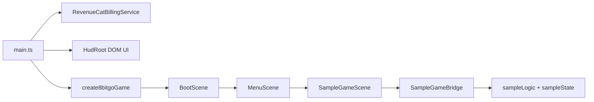

# 8bitgo MVP Architecture

## Goal

The MVP proves that `8bitgo` can produce small iOS-ready 8bit games faster than starting from raw Phaser each time. The framework layer should provide reusable style, purchase flow, save profile, and release checks. Phaser remains the battle-tested renderer and scene host.

## Boundaries

`8bitgo` owns:

- fixed virtual screen defaults;
- pixel-art texture generation and scaling rules;
- DOM HUD/paywall shell;
- profile persistence;
- billing service contract;
- build and App Review guardrails.

Game projects own:

- actual mechanics;
- level data;
- progression design;
- final art/audio;
- App Store product positioning.

Phaser owns:

- canvas rendering;
- input;
- scene lifecycle;
- camera and timing;
- texture manager.

## Runtime Flow

## Why Not Build A Full Engine Now

The hard part is not drawing pixels. The hard part is maintaining enough gameplay capability to ship repeatedly. The MVP deliberately avoids rewriting physics, asset loading, animation systems, mobile packaging, and store integration from scratch. Phaser and Capacitor handle those layers while `8bitgo` standardizes the parts that matter for your IAP product factory.

## MVP Success Criteria

- A new small game can reuse the same shell and replace only `src/game`.
- Browser preview builds without native tools.
- iOS platform can be generated and synced from the same codebase.
- A RevenueCat non-consumable unlock path is present before game content grows.
- Visual output keeps one coherent pixel scale across world, HUD, and paywall.
